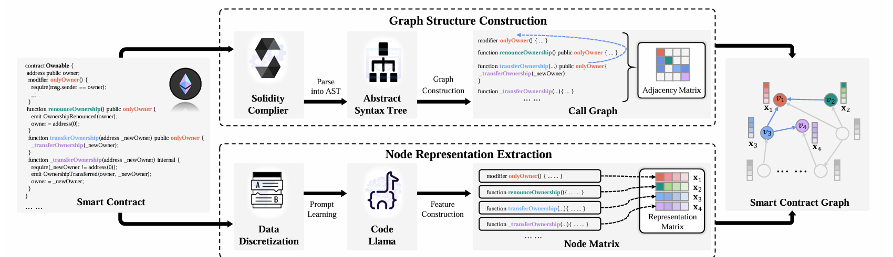

# ConSense: Graph-based Contract Sensing Framework for Smart Contract Vulnerability Detection

> 🎉 This work is published in [IEEE Transactions on Big Data](https://ieeexplore.ieee.org/document/11104930)

# Network Architecture





# Data Description

## IR-ESCD

This dataset focuses on eight types of security vulnerabilities: timestamp dependency (TP), block number dependency (BN), dangerous delegatecall (DE), Ether frozen (EF), unchecked external call (UC), reentrancy (RE), integer overflow (OF), and dangerous Ether strict equality (SE).

Dataset source: https://github.com/Messi-Q/Smart-Contract-Dataset (Resource 3)

```tex
@article{liu2023rethinking,
  title={Rethinking smart contract fuzzing: Fuzzing with invocation ordering and important branch revisiting},
  author={Liu, Zhenguang and Qian, Peng and Yang, Jiaxu and Liu, Lingfeng and Xu, Xiaojun and He, Qinming and Zhang, Xiaosong},
  journal={IEEE Transactions on Information Forensics and Security},
  volume={18},
  pages={1237--1251},
  year={2023},
  publisher={IEEE}
}
```

##  SCVHunter-SCD

This dataset includes 203 contracts with reentrancy vulnerabilities, 60 contracts exhibiting timestamp dependency vulnerabilities, and 180 contracts with transaction state dependency vulnerabilities.

Dataset source: https://figshare.com/articles/software/scvhunter/24566893/1?file=43154218

```tex
@inproceedings{luo2024scvhunter,
  title={Scvhunter: Smart contract vulnerability detection based on heterogeneous graph attention network},
  author={Luo, Feng and Luo, Ruijie and Chen, Ting and Qiao, Ao and He, Zheyuan and Song, Shuwei and Jiang, Yu and Li, Sixing},
  booktitle={Proceedings of the IEEE/ACM 46th international conference on software engineering},
  pages={1--13},
  year={2024}
}
```

# Results


# Runing

1. Label Preprocess

```
cd ./label_process
python label_ir.py
python label_scvhunter.py
```

2. Contract Graph Generation

```
cd ./sc_graph
python graph_ir.py
python graph_scvhunter.py
```

3. Train and eval

```
python main.py
```

# Requirements

```bash
# Ubuntu 22.04.4 LTS

# create conda environment
conda create -n ConSense python=3.10

# ConSense env
pip install pandas
pip install openpyxl
pip install slither-analyzer==0.10.4
pip install torch==2.0.0 torchvision==0.15.1 torchaudio==2.0.1 --index-url https://download.pytorch.org/whl/cu118
pip install transformers
pip install pyg_lib torch_scatter torch_sparse torch_cluster torch_spline_conv -f https://data.pyg.org/whl/torch-2.0.0+cu118.html
pip install torch_geometric
pip install einops
pip install scikit-learn
```

